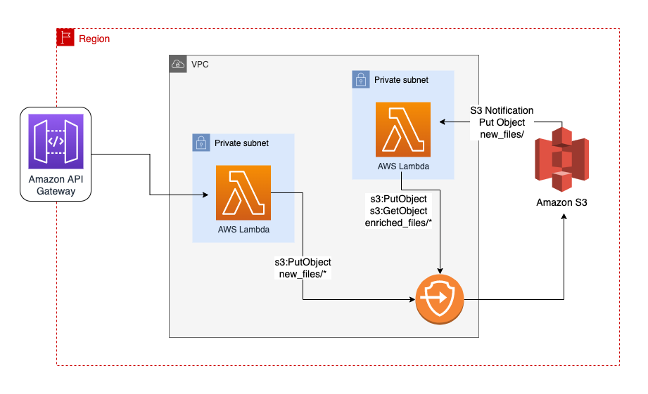

# AWS Lambda in Private Subnet connecting to S3 with VPC Endpoint

CDK example of:

- AWS Lambda running inside a VPC
- Connecting to S3 via VPC Endpoints and not via public internet
- VPC doesn't have NAT Gateways attached
- Completely isolated network running AWS Lambda code
- VPC Endpoint policies to limit S3 actions by Lambda

Final architecture:

